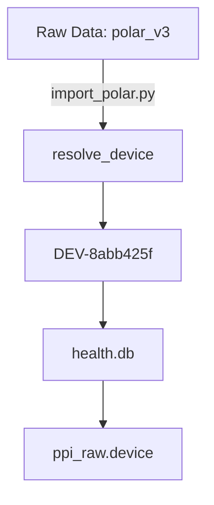
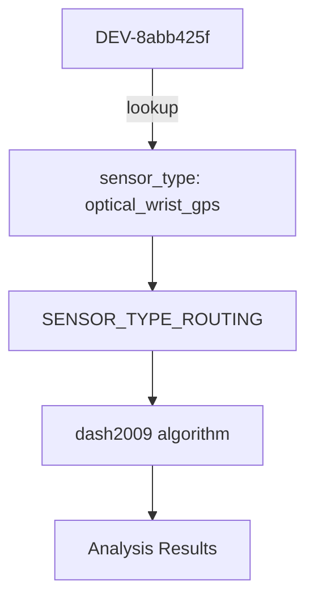

# Kyoro-HealthHub Privacy Architecture

## Core Privacy Principle

**"No human-readable device model or person/relationship identifier leaves local-only config — not even into health.db or medicine.db"**

This principle extends Kyoro-HealthHub's existing serial-number pseudonymization to cover all locally-identifying values, ensuring that:

1. **Storage**: Only opaque pseudonyms are stored in databases
2. **Resolution**: Local-only mapping via `identity_resolver` module
3. **Display**: Just-in-time resolution for human-readable reports
4. **Routing**: Semantic operations use abstract properties (sensor_type), not identifiers

## Implementation Layers

### 1. Identity Resolver Module (`scripts/modules/identity_resolver.py`)

**Centralized Pseudonym Management**

```python
from modules.identity_resolver import resolve_device, resolve_person, reverse_resolve

# Forward resolution (real → pseudonym)
dev_pseudo = resolve_device("polar_v3")  # "DEV-8abb425f"
person_pseudo = resolve_person("self")   # "PER-6173fec1"

# Reverse resolution (pseudonym → real)
real_device = reverse_resolve(dev_pseudo)  # "polar_v3"

# Human-readable display names for reports
display_name = resolve_display_name(dev_pseudo)  # "polar_v3 (optical_wrist_gps)"
```

**Properties**:
- **Deterministic**: salted SHA-256-based, same input (with the same local salt) → same output
- **Salted**: every hash is combined with a random, once-generated salt persisted in the `pseudonym_salt` table in `identity.db` (never in `health.db`/`medicine.db`/the repo) — without it, the low-cardinality real values (a few dozen known device-model strings, `'self'`/`'partner'`) would be breakable by anyone with database access simply by hashing every known candidate and comparing
- **Local-only**: No network access, all data in `~/.config/kyoro/identity.db`
- **Idempotent**: Safe to re-run, existing pseudonyms preserved (the salt is generated once and never changes, so a given real value always resolves to the same pseudonym)
- **Reversible**: Local admin can audit via `identity.db`

### 2. Database Schema

**Pseudonym Storage Only**

```sql
-- health.db and medicine.db contain ONLY pseudonyms
CREATE TABLE devices (
    device_id TEXT PRIMARY KEY,  -- "DEV-8abb425f", never "polar_v3"
    person TEXT,                -- "PER-6173fec1", never "self"
    -- ... other columns
);

CREATE TABLE measurements (
    device_id TEXT,             -- "DEV-8abb425f"
    person TEXT,                -- "PER-6173fec1"
    -- ... other columns
);
```

**Identity Database** (`~/.config/kyoro/identity.db`):
```sql
-- Real ↔ Pseudonym mappings (local only, never in repo)
CREATE TABLE device_id_map (
    pseudo_id TEXT PRIMARY KEY,  -- "DEV-8abb425f"
    device_id_real TEXT,         -- "polar_v3"
    created_at TIMESTAMP
);

CREATE TABLE person_map (
    pseudo_id TEXT PRIMARY KEY,  -- "PER-6173fec1"
    person_real TEXT,            -- "self"
    created_at TIMESTAMP
);

-- Single-row table holding the local secret salt mixed into every
-- pseudonym hash (see "Identity Resolver Module" above). Generated once
-- with `secrets.token_hex(32)` on first use and never written anywhere
-- outside this database.
CREATE TABLE pseudonym_salt (
    id INTEGER PRIMARY KEY CHECK (id = 1),
    salt_hex TEXT NOT NULL
);
```

### 3. Semantic Routing via Sensor Types

**Abstract Device Properties, Not Identifiers**

```python
# compute_arrhythmia.py
SENSOR_TYPE_ROUTING = {
    'chest_strap':        'tateno_glass',    # Polar H7/H10
    'optical_wrist_gps':  'dash2009',        # Polar V3, Garmin Fenix
    'ring':               'sampentropy',      # Oura Ring
    'smartphone':         'sampentropy',      # Camera PPG
}

# Resolution flow:
# 1. Get device_id from database (pseudonym: "DEV-8abb425f")
# 2. Lookup sensor_type from registry: "optical_wrist_gps"
# 3. Route via sensor_type: "dash2009"
# 4. Never compare pseudonym strings directly
```

### 4. Human-Readable Reports

**Just-In-Time Resolution for Display**

```python
# analyse_ecg_session.py
device_display = resolve_display_name(device_id)  # "polar_v3 (optical_wrist_gps)"

print(f"Device: {device_display}")  # Human-readable in report
print(f"Algorithm: {algorithm}")    # Based on sensor_type

# Database still contains: "DEV-8abb425f"
# Report shows: "polar_v3 (optical_wrist_gps)"
```

## Data Flow Examples

### Import Flow (Pseudonymization)



### Analysis Flow (Resolution)

```mermaid
graph TD
    A[health.db] -->|DEV-8abb425f| B[compute_arrhythmia.py]
    B --> C[resolve_display_name]
    C --> D[polar_v3 (optical_wrist_gps)]
    D --> E[Report/Analysis Output]
```

### Routing Flow (Abstraction)



## Privacy Guarantees

### ✅ Storage Privacy
- **No semantic identifiers** in `health.db` or `medicine.db`
- **No semantic identifiers** in Git repository
- **No semantic identifiers** in backups (post-migration)

### ✅ Processing Privacy
- **All resolution happens locally** (no network calls)
- **Deterministic pseudonyms** (no tracking across instances)
- **No round-tripping** (real names never stored in databases)

### ✅ Reporting Privacy
- **Reports show human-readable names** (for usability)
- **Databases store only pseudonyms** (for privacy)
- **Resolution happens at display time** (not storage time)

### ✅ Auditability
- **Local admin can reverse** pseudonyms via `identity.db`
- **Migration scripts include dry-run** mode for verification
- **Row counts verified** before/after migration

## Scope and Limitations

### In Scope ✅
- `device_id` values in all tables (devices, measurements, ppi_raw, etc.)
- `person` values in all tables (self, partner, etc.)
- `device` column in ppi_raw table
- Display name resolution for reports
- Sensor-type based algorithm routing

### Out of Scope ❌
- Source app names (polar_connect, apple_health, etc.) — these are not identifiers
- Clinical text content in medicine.db — covered by separate privacy measures
- Backup files and git history — historical data not modified
- External system identifiers — handled by those systems' privacy policies

### Known Limitations
- **Legacy data**: Old backups predating the migration still contain semantic identifiers — historical data is not modified (see "Out of Scope" above)
- **Cross-source device-ID mismatch**: a physical device can appear under different real-value spellings across sources (an `SN-` serial pseudonym, a raw hex serial, a semantic name such as `polar_ignite2`). `identity_resolver._canonicalize_device()` normalizes known spellings via `device_serial_map` before hashing, but this depends on that table already knowing the mapping — a genuinely new spelling that hasn't been registered yet would still hash into its own, separate `DEV-XXXXXXXX` pseudonym instead of being recognized as the same device. This is a real, still-open follow-up problem, not a migration defect.
- **Raw `sqlite3.connect()` call sites**: production importers and compute scripts go through `modules/db.py`'s `open_db()`/`open_medicine_db()`, which installs the pseudonymization safeguard trigger and SQL functions per connection. Any script that opens the database with `sqlite3.connect()` directly instead would crash on write with `no such function: pseudonymize_person` (or write plaintext without the trigger). The production pipeline is covered; test/utility scripts outside that path have not been exhaustively audited for this.

## Compliance Checklist

### Storage Layer
- [x] `health.db` uses pseudonyms only
- [x] `medicine.db` uses pseudonyms only
- [x] `identity.db` stores real↔pseudonym mappings locally
- [x] No semantic identifiers in database schemas

### Processing Layer
- [x] All device_id lookups go through `identity_resolver`
- [x] All person lookups go through `identity_resolver`
- [x] Algorithm routing uses `sensor_type`, not device_id strings
- [x] No direct `device_id == "polar_v3"` comparisons in code

### Reporting Layer
- [x] Reports use `resolve_display_name()` for human-readable output
- [x] Database queries use pseudonyms
- [x] Display resolution happens at render time
- [x] Fallback mechanisms for missing mappings

### Documentation
- [x] Code docstrings updated
- [x] User documentation generated
- [x] Migration scripts documented
- [x] Privacy architecture documented (this file)

## Migration Procedure (Historical Reference — Already Executed)

The migration below has already been run against the real `health.db` and
`medicine.db` (see `openspec/changes/archive/pseudonymize-device-person-identifiers/`
for the full record: all tables committed, 0 errors, 0 data loss). It is kept
here as a reference for what the one-time migration looked like — for
example if a fresh install is later migrated from an old, pre-pseudonymization
backup.

```bash
# 1. Backup databases
cp data/health.db data/health.db.bak.$(date +%Y-%m-%d)
cp data/medicine.db data/medicine.db.bak.$(date +%Y-%m-%d)

# 2. Generate pseudonyms for existing data
python3 scripts/migrations/generate_pseudonyms_for_existing_data.py

# 3. Test migration (dry-run)
python3 scripts/migrations/pseudonymize_device_person_identifiers.py --dry-run

# 4. Execute migration
python3 scripts/migrations/pseudonymize_device_person_identifiers.py --execute

# 5. Update registry
python3 scripts/migrations/update_registry_with_pseudonyms.py --execute

# 6. Verify results
python3 tools/qa_check.py
sqlite3 data/health.db "SELECT DISTINCT device_id FROM devices;"

# 7. Test reports
python3 scripts/analysis/manual/analyse_ecg_session.py
```

## Verification Commands

```bash
# Check pseudonyms are being used
sqlite3 data/health.db "SELECT device_id FROM devices LIMIT 5;"
# Should show: DEV-XXXXXXXX format

# Check identity mappings
sqlite3 ~/.config/kyoro/identity.db "SELECT * FROM device_id_map LIMIT 5;"
# Should show real→pseudonym mappings

# Test resolution
python3 -c "from modules.identity_resolver import resolve_display_name; print(resolve_display_name('DEV-8abb425f'))"
# Should show: "polar_v3 (optical_wrist_gps)"

# Test OWN_PERSON_ID
python3 -c "from health_config import OWN_PERSON_ID; print(OWN_PERSON_ID)"
# Should show: PER-XXXXXXXX format
```

## Future Extensions

The `identity_resolver` module is designed as a **generic pseudonym registry** and can be extended to handle additional identifier types:

```python
# Future extensions
resolve_home_assistant_instance("homeassistant_main")  # "HA-XXXXXXXX"
resolve_weather_station("ecowitt_outdoor")         # "WS-XXXXXXXX"
resolve_location("home_gps_coordinates")           # "LOC-XXXXXXXX"
```

This allows Kyoro-HealthHub to maintain the privacy principle as new device types and identifiers are added to the system.

## References

- **OpenSpec Change**: `openspec/changes/archive/pseudonymize-device-person-identifiers/`
- **Design Document**: `openspec/changes/archive/pseudonymize-device-person-identifiers/design.md`
- **Implementation Summary**: local migration summary (not part of this repo)
- **Identity Resolver API**: `docs/en/modules/identity_resolver.md`
- **Migration Scripts**: `scripts/migrations/pseudonymize_device_person_identifiers.py`

## Appendix: Pseudonym Format Specification

### Device and Person Identifiers (salted, via `identity_resolver`)
- **Hash**: First 8 characters of SHA-256(`f"{local_salt}:{kind}:{real_value}"`), where `kind` is `"device"` or `"person"` and `local_salt` is the 32-byte hex secret from the `pseudonym_salt` table in `~/.config/kyoro/identity.db` (generated once via `secrets.token_hex(32)`, never committed or transmitted)
- Without the salt, an attacker with database access could break the pseudonym by hashing every known candidate device-model string or `person` value and comparing — the salt is what makes that dictionary attack infeasible

### Device Identifiers
- **Prefix**: `DEV-`
- **Example**: `DEV-8abb425f`
- **Regex**: `^DEV-[0-9a-f]{8}$`

### Person Identifiers
- **Prefix**: `PER-`
- **Example**: `PER-6173fec1`
- **Regex**: `^PER-[0-9a-f]{8}$`

### Serial Numbers (Existing, unsalted)
- **Prefix**: `SN-`
- **Hash**: First 8 characters of SHA-256(`real_serial`) (`scripts/utils/anonymize.py`) — this predates `identity_resolver` and is not salted; serial numbers have much higher cardinality than `device_id`/`person`, so the dictionary-attack risk that motivated salting DEV-/PER- pseudonyms does not apply the same way here
- **Example**: `SN-4a8fd0b9`
- **Regex**: `^SN-[0-9a-f]{8}$`

### Account Identifiers (Existing, unsalted)
- **Prefix**: `ACC-`
- **Example**: `ACC-1d9ef68b`
- **Regex**: `^ACC-[0-9a-f]{8}$`

All pseudonyms are **deterministic** (same input → same output) and **locally reversible** (via `identity.db`).